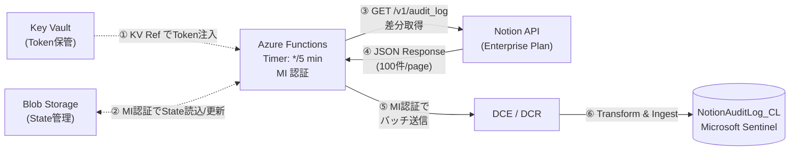

# Notion Audit Log → Microsoft Sentinel (Azure Functions)

Notion の [Audit Log API](https://developers.notion.com/reference/get-audit-log) から監査ログを自動取得し、Microsoft Sentinel の `NotionAuditLog_CL` カスタムテーブルへインジェストする Azure Functions ソリューションです。

**セキュリティ強化版** — Key Vault Reference / Managed Identity / SharedKey 無効化 / Blob パッケージデプロイ

## アーキテクチャ



## 特徴

| 特徴 | 詳細 |
|---|---|
| **差分取得** | Blob Storage に前回ポーリング時刻を保持し、`start_date` パラメータで差分のみ取得 |
| **Key Vault Reference** | Notion Token は Key Vault に格納。`@Microsoft.KeyVault(...)` 形式で環境変数に自動注入 |
| **SharedKey 無効化** | Storage Account の SharedKey を完全無効化。全アクセスを MI + RBAC で制御 |
| **Identity-based Storage** | `AzureWebJobsStorage__accountName` 形式で MI ベース接続 |
| **Blob パッケージデプロイ** | `WEBSITE_RUN_FROM_PACKAGE` + MI 認証で zip をマウント |
| **SDK バッチ送信** | `LogsIngestionClient` による自動バッチング (max 1MB/req) とリトライ |
| **レートリミット対応** | 429 時の指数バックオフ (3回リトライ) |
| **低コスト** | Consumption Y1 プランで月額 **$1〜$5** |

## 前提条件

### Notion

- **Enterprise プラン**（Audit Log API は Enterprise 限定）
- `Read audit logs` 権限を持つ Internal Integration Token

### Azure

- Azure サブスクリプション（Owner または Contributor + User Access Administrator）
- Sentinel が有効化された Log Analytics ワークスペース
- Azure CLI v2.60 以上
- Python 3.9 以上（ローカルビルド用。ランタイムは 3.11）

## ファイル構成

```
├── README.md                    # 本ファイル
├── deploy.bicep                 # インフラ一括デプロイ（Func + Storage + KV + AI + DCE/DCR + RBAC）
├── build_and_deploy.py          # zip ビルド & Blob デプロイ自動化スクリプト
└── function_app/
    ├── function_app.py          # Timer Trigger: Notion API → スキーマ変換 → Logs Ingestion API
    ├── requirements.txt         # Python 依存パッケージ
    └── host.json                # Functions ランタイム設定
```

## デプロイされるリソース

Bicep により以下のリソースが一括デプロイされます。

| # | リソース種類 | 名前パターン | 目的 |
|---|---|---|---|
| 1 | Function App (Linux, Python 3.11) | `{baseName}-func-{suffix}` | Timer Trigger, Consumption Y1 |
| 2 | App Service Plan (Dynamic Y1) | `{baseName}-plan-{suffix}` | Consumption 課金プラン |
| 3 | Storage Account | `st{baseName}{suffix}` | Functions バックエンド + State Blob |
| 4 | Application Insights | `{baseName}-ai-{suffix}` | 実行ログ・メトリクス監視 |
| 5 | Key Vault | `kv-{baseName}-{suffix}` | Notion Token 格納 |
| 6 | DCE | `{baseName}-dce-{suffix}` | ログ受信エンドポイント |
| 7 | DCR | `{baseName}-dcr-{suffix}` | スキーマ定義・ルーティング |

RBAC は Bicep 内で自動割り当て:
- **Key Vault Secrets User** → Function App MI（Token 読み取り）
- **Storage Blob Data Owner** → Function App MI（State Blob + ランタイム）
- **Storage Queue Data Contributor** → Function App MI（ランタイム）
- **Storage Table Data Contributor** → Function App MI（ランタイム）
- **Monitoring Metrics Publisher** → Function App MI（DCR スコープ）

## クイックスタート

### Step 1: Bicep でインフラをデプロイ

```bash
# リソースグループ作成
az group create --name <RG_NAME> --location <REGION>

# Bicep デプロイ
az deployment group create \
  --resource-group <RG_NAME> \
  --template-file deploy.bicep \
  --parameters sentinelWorkspaceResourceId="<WORKSPACE_RESOURCE_ID>"
```

> **⚠ リージョン**: Consumption Plan のクォータがないリージョンではデプロイが失敗します。`japaneast` で `SkuNotAvailable` エラーが出る場合は `switzerlandnorth` 等を試してください。

### Step 2: Notion Integration Token を Key Vault に格納

```bash
# デプロイ出力から Key Vault 名を取得
KV_NAME=$(az deployment group show \
  --resource-group <RG_NAME> --name deploy \
  --query properties.outputs.keyVaultName.value -o tsv)

# Token を格納
az keyvault secret set \
  --vault-name $KV_NAME \
  --name NotionIntegrationToken \
  --value "<NOTION_INTEGRATION_TOKEN>"
```

### Step 3: Function App コードをデプロイ

```bash
# デプロイ出力からリソース名を取得
FUNC_NAME=$(az deployment group show \
  --resource-group <RG_NAME> --name deploy \
  --query properties.outputs.functionAppName.value -o tsv)
STORAGE_NAME=$(az deployment group show \
  --resource-group <RG_NAME> --name deploy \
  --query properties.outputs.storageAccountName.value -o tsv)

# 自動化スクリプトで Blob デプロイ
python build_and_deploy.py \
  --resource-group <RG_NAME> \
  --function-app $FUNC_NAME \
  --storage-account $STORAGE_NAME \
  --blob-name release-$(date +%Y%m%d%H%M%S).zip
```

> **前提**: デプロイ実行ユーザーが Storage Account に対し **Storage Blob Data Contributor** 以上の RBAC を持っている必要があります（`--auth-mode login` でアップロードするため）。

### Step 4: 動作確認

```bash
# 手動トリガー
MASTER_KEY=$(az functionapp keys list \
  --name $FUNC_NAME --resource-group <RG_NAME> \
  --query masterKey -o tsv)

curl -X POST \
  "https://$FUNC_NAME.azurewebsites.net/admin/functions/notion_audit_log_timer" \
  -H "x-functions-key: $MASTER_KEY" \
  -H "Content-Type: application/json" \
  -d '{}'
```

期待されるレスポンス: **HTTP 202 (Accepted)**

### KQL でデータ到達確認

```kusto
NotionAuditLog_CL
| where TimeGenerated > ago(1h)
| summarize Count = count() by EventCategory, EventType
| order by Count desc
```

## デプロイ方法の詳細

本ソリューションは **Blob パッケージデプロイのみ** をサポートします。

> **理由**: `allowSharedKeyAccess: false` を設定するため、SharedKey を使用する `func publish` は利用できません。

### `build_and_deploy.py` の動作

| Step | 処理内容 |
|---|---|
| 1 | `pip install` で Linux Python 3.11 向けパッケージをダウンロード |
| 2 | `.python_packages/lib/site-packages/` 配下に配置して zip 作成 |
| 3 | `az storage blob upload --auth-mode login` で Blob にアップロード |
| 4 | `WEBSITE_RUN_FROM_PACKAGE` を Blob URL に設定 |
| 5 | Function App を再起動 |

### ビルドの仕組み

ローカル環境の Python バージョン・OS に関わらず、以下のオプションで Azure Functions ランタイム (Linux Python 3.11) 互換のパッケージを取得します:

```
pip install --platform manylinux2014_x86_64 --python-version 3.11 --only-binary=:all:
```

### パラメータ

```bash
python build_and_deploy.py \
  --resource-group <RG_NAME> \          # リソースグループ名
  --function-app <FUNCTION_APP_NAME> \  # Function App 名
  --storage-account <STORAGE_ACCOUNT> \ # Storage Account 名
  --blob-name <BLOB_NAME> \             # zip ファイル名（デフォルト: release.zip）
  --container <CONTAINER> \             # Blob コンテナ名（デフォルト: function-releases）
  --function-app-dir <DIR>              # ソースディレクトリ（デフォルト: ./function_app）
```

> **推奨**: `--blob-name` にタイムスタンプ付きの名前を指定してください（例: `release-20260522.zip`）。同名 blob を上書きすると、ランタイムのキャッシュにより古いコードが使われ続ける場合があります。

## トラブルシューティング

| 症状 | 原因 | 対処 |
|---|---|---|
| Bicep デプロイで `SkuNotAvailable` | リージョンに Consumption Plan クォータなし | 別リージョン（`switzerlandnorth` 等）を使用 |
| `func publish` が 403 | `allowSharedKeyAccess: false` (設計上の仕様) | `build_and_deploy.py` を使用 |
| Blob アップロードで 403 | デプロイユーザーに Storage RBAC なし | Storage Blob Data Contributor を割り当て |
| 関数が 0 件 (`function list` が空) | CLI キャッシュの問題 | Admin API (`/admin/functions`) で直接確認 |
| Python ImportError (cryptography) | Windows/他バージョンでビルドされた zip | `--platform manylinux2014_x86_64` で再ビルド |
| パッケージが見つからない (ModuleNotFoundError) | zip 内パス不正 | `.python_packages/lib/site-packages/` 配下に配置 |
| Key Vault Reference が `Unauthorized` | MI に KV Secrets User なし | RBAC 割り当てを確認 |
| Key Vault Reference が `VaultNotFound` | KV FW が Deny (Consumption Plan 非対応) | `defaultAction: Allow` に変更 |
| Notion API 401 | Token 無効/期限切れ | KV から Token 取得して直接テスト |
| Notion API 403 | Enterprise プラン以外 | Notion 管理画面でプラン確認 |
| データが来ない | DCR RBAC 不足 or インジェスト遅延 | Monitoring Metrics Publisher を確認。5〜10 分待つ |

### Key Vault Firewall と Consumption Plan

Azure Functions Consumption Plan では、Key Vault の Firewall を `defaultAction: Deny` にすると Key Vault Reference が解決できません。これは Consumption Plan のアウトバウンド IP が動的で予測不可能なためです。

**対処**: Key Vault FW は `defaultAction: Allow` としつつ、RBAC でアクセス制御を担保します。Premium Plan / VNet 統合を使用する場合は `defaultAction: Deny` + Private Endpoint が可能です。

## セキュリティ設計

| 項目 | 設定 |
|---|---|
| **Token 管理** | Key Vault Reference（App Settings に直接格納しない） |
| **Storage 認証** | MI 認証のみ（SharedKey 完全無効化） |
| **Key Vault FW** | `defaultAction: Allow`（Consumption Plan 制限。RBAC で保護） |
| **Function FW** | Access Restrictions: AzureCloud のみ許可 |
| **デプロイ** | Blob パッケージデプロイ（MI 認証で zip 読み込み） |
| **RBAC** | 最小権限の原則（各リソースに必要最小限のロールのみ割り当て） |

## コスト目安

| リソース | SKU | 月額目安 |
|---|---|---|
| Function App | Consumption Y1 | $0〜$5 |
| Storage Account | Standard LRS | ~$0.01 |
| Key Vault | Standard | ~$0.03 |
| Application Insights | 従量課金 | $0.50〜$2 |
| DCE / DCR | — | 無料 |
| **合計** | | **$1〜$5/月** |

> Log Analytics へのデータインジェスト課金 ($2.76/GB) は含まれていません。Notion Audit Log は軽量 (1件 ~500B) のため、月10万件でも ~50MB (~$0.14) 程度です。

## アンインストール

```bash
az group delete --name <RG_NAME> --yes --no-wait
```

> Log Analytics ワークスペース内の `NotionAuditLog_CL` テーブルは、リソースグループ削除では消えません（ワークスペースが別 RG にある場合）。

## Notion Audit Log API 仕様準拠

| 仕様項目 | 公式仕様 | 本ツール |
|---|---|---|
| エンドポイント | `GET /v1/audit_log` | ✓ |
| 認証方式 | `Authorization: Bearer {token}` | ✓ |
| API バージョン | `Notion-Version: 2022-06-28` | ✓ |
| ページネーション | カーソルベース (`next_cursor`) | ✓ |
| レートリミット | 3 req/sec, 429 + Retry-After | ✓ (指数バックオフ) |
| イベントカテゴリ | 5 カテゴリ | ✓ |
| 差分取得 | `start_date` パラメータ | ✓ (State Blob で自動管理) |

## ライセンス

MIT
