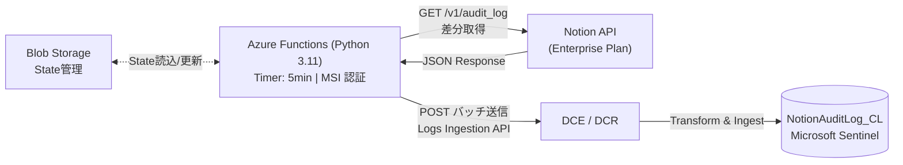

# Notion Audit Log → Microsoft Sentinel (Azure Functions)

Notion の [Audit Log API](https://developers.notion.com/reference/get-audit-log) から監査ログを自動取得し、Microsoft Sentinel の `NotionAuditLog_CL` カスタムテーブルへインジェストする Azure Functions ソリューションです。

## アーキテクチャ



## 特徴

| 特徴 | 詳細 |
|---|---|
| **差分取得** | Blob Storage に前回ポーリング時刻を保持し、`start_date` パラメータで差分のみ取得 |
| **App Settings 直接格納** | Notion Token は `@secure()` Bicep パラメータ経由で App Settings に安全に格納。Key Vault 不要 |
| **Identity-based Storage** | Blob Storage は MSI + RBAC。Shared Key 不使用でポリシー準拠 |
| **SDK バッチ送信** | `LogsIngestionClient` による自動バッチング (max 1MB/req) とリトライ |
| **レートリミット対応** | 429 時の指数バックオフ |
| **低コスト** | Consumption Y1 プランで月額 **$3〜$10** |

## 前提条件

### Notion

- **Enterprise プラン**（Audit Log API は Enterprise 限定）
- `Read audit logs` 権限を持つ Internal Integration Token

### Azure

- Azure サブスクリプション（Contributor + User Access Administrator / Owner）
- Sentinel が有効化された Log Analytics ワークスペース
- Azure CLI v2.60 以上
- Python 3.11

## ファイル構成

```
├── params.json                          # パラメータテンプレート（最初にこれを編集）
├── deploy.ps1                           # ワンクリック展開スクリプト
├── ISS-046_deploy.bicep                 # インフラ一括デプロイ（Func + Storage + AI + DCE/DCR + RBAC）
├── ISS-046_build_and_deploy.py          # 方法 B 用 zip ビルド & デプロイ自動化
└── ISS-046_function_app/
    ├── function_app.py                  # Timer Trigger: Notion API → スキーマ変換 → Logs Ingestion API
    ├── requirements.txt                 # Python 依存パッケージ
    └── host.json                        # Functions ランタイム設定
```

## デプロイされるリソース

Bicep により以下のリソースが一括デプロイされます。

| # | リソース種類 | 名前パターン | 目的 |
|---|---|---|---|
| 1 | Function App (Linux, Python 3.11) | `{baseName}-func-{suffix}` | Timer Trigger, Consumption Y1 |
| 2 | App Service Plan (Dynamic Y1) | `{baseName}-plan-{suffix}` | Consumption 課金プラン |
| 3 | Storage Account | `st{baseName}{suffix}` | Functions バックエンド + State Blob |
| 4 | Application Insights | `{baseName}-ai-{suffix}` | 実行ログ・メトリクス監視 |
| 5 | DCE | `{baseName}-dce-{suffix}` | ログ受信エンドポイント |
| 6 | DCR | `{baseName}-dcr-{suffix}` | スキーマ定義・ルーティング |

> **Notion Token**: `@secure()` Bicep パラメータとして渡され、Function App の App Settings (`NOTION_TOKEN_DIRECT`) に直接格納されます。Key Vault は使用しません。

RBAC は Bicep 内で自動割り当て:
- **Storage Blob Data Contributor** → Function App MSI
- **Monitoring Metrics Publisher** → Function App MSI (DCR スコープ)

## クイックスタート

### 1. パラメータファイルの編集

`params.json` を開き、環境情報を記入します。

```json
{
  "azure": {
    "subscriptionId": "xxxxxxxx-xxxx-xxxx-xxxx-xxxxxxxxxxxx",
    "resourceGroupName": "Notion-Audit-Func-RG",
    "location": "japaneast"
  },
  "sentinel": {
    "workspaceResourceId": "/subscriptions/xxx/.../workspaces/xxx"
  },
  "notion": {
    "integrationToken": "secret_XXXXXXXXXXXX..."
  },
  "options": {
    "baseName": "notion-audit",
    "pollingIntervalMinutes": 5
  }
}
```

> **リージョン制約**: DCE/DCR は Log Analytics ワークスペースと**同じリージョン**に配置する必要があります。`location` を Sentinel ワークスペースと同じリージョンに設定してください。

### 2. 自動デプロイの実行

```powershell
az login
az account set --subscription "<SUB_ID>"
.\deploy.ps1
```

スクリプトが以下を自動実行します:

| Step | 内容 |
|---|---|
| 0 | Azure CLI ログイン確認 |
| 1 | リソースグループ作成 |
| 2 | Bicep デプロイ (全インフラ + Notion Token を App Settings に格納) |
| 3 | Function App コードデプロイ |
| 4 | 動作確認 |

> `deploy.ps1` はデプロイ後に Storage Account の `allowSharedKeyAccess` プロパティを自動検出し、`false` の場合は方法 A (`func publish`) → 方法 B (Blob パッケージデプロイ) に自動切替します。

### 3. Notion Integration Token の作成

1. [https://www.notion.so/my-integrations](https://www.notion.so/my-integrations) にアクセス
2. 「+ New integration」→ Integration name を入力
3. Associated workspace を選択 → Submit
4. **Capabilities** タブ → 「**Read audit logs**」にチェック → Save changes
5. **Secrets** タブ → Token をコピー

> ⚠ Token は一度しか完全に表示されません。

## 手動デプロイ

自動デプロイを使わない場合、各ステップを個別に実行できます。

### リソースグループ作成 & Bicep デプロイ

```powershell
az group create --name Notion-Audit-Func-RG --location japaneast

az deployment group create `
  --resource-group Notion-Audit-Func-RG `
  --template-file ISS-046_deploy.bicep `
  --parameters `
    sentinelWorkspaceResourceId="<WORKSPACE_RESOURCE_ID>" `
    notionToken="<NOTION_INTEGRATION_TOKEN>"
```

> `notionToken` は `@secure()` パラメータです。Bicep が Function App の App Settings (`NOTION_TOKEN_DIRECT`) に直接格納します。

### コードデプロイ — 方法 A (標準環境)

```powershell
cd ISS-046_function_app
func azure functionapp publish <FUNCTION_APP_NAME> --build remote
```

> `--build remote` により Azure 側で依存パッケージが自動インストールされます。ローカルでの `pip install --target` は不要です。

### コードデプロイ — 方法 B (allowSharedKeyAccess: false 環境)

`ISS-046_build_and_deploy.py` を使うか、以下の手順で zip パッケージをデプロイします:

1. Linux x86_64 クロスビルドで zip を作成 (`--platform manylinux2014_x86_64`)
2. Blob Storage にアップロード (`az storage blob upload --auth-mode login`)
3. App Settings で `WEBSITE_RUN_FROM_PACKAGE` を Blob URL に設定
4. Function App を再起動

## 動作確認

### 手動トリガー

```powershell
$masterKey = az functionapp keys list `
  --name <FUNCTION_APP_NAME> `
  --resource-group Notion-Audit-Func-RG `
  --query masterKey -o tsv

Invoke-RestMethod `
  -Uri "https://<FUNCTION_APP_NAME>.azurewebsites.net/admin/functions/notion_audit_log_timer" `
  -Method Post `
  -Headers @{ "x-functions-key" = $masterKey; "Content-Type" = "application/json" } `
  -Body '{}'
```

### KQL でデータ到達確認

```kusto
NotionAuditLog_CL
| where TimeGenerated > ago(1h)
| summarize Count = count() by EventCategory, EventType
| order by Count desc
```

## トラブルシューティング

| 症状 | 原因 | 対処 |
|---|---|---|
| `func publish` が 403 | `allowSharedKeyAccess: false` ポリシー | 方法 B (Blob デプロイ) を使用 |
| 関数が 0 件 | `EnableWorkerIndexing` 未設定 | App Settings で `AzureWebJobsFeatureFlags=EnableWorkerIndexing` を確認 |
| 関数が起動するが import エラー | zip に Windows バイナリ (.pyd) が混入 | `--platform manylinux2014_x86_64` で zip を再作成 |
| Notion API 401 | Token 無効/期限切れ | Azure Portal → Function App → 構成 → `NOTION_TOKEN_DIRECT` を確認・更新 |
| Notion API 403 | Enterprise プラン以外 | Notion 管理画面でプラン確認 |
| データが来ない | DCR RBAC 不足 or インジェスト遅延 | Monitoring Metrics Publisher RBAC を確認。5〜10 分待つ |

## コスト目安

| リソース | SKU | 月額目安 |
|---|---|---|
| Function App | Consumption Y1 | $0〜$5 |
| Storage Account | Standard LRS | $1〜$2 |
| Application Insights | 従量課金 | $2〜$5 |
| DCE / DCR | — | 無料 |
| **合計** | | **$3〜$10/月** |

> Log Analytics へのデータインジェスト課金 ($2.76/GB) は含まれていません。Notion Audit Log は軽量 (1件 ~500B) のため、月10万件でも ~50MB (~$0.14) 程度です。

## アンインストール

```powershell
az group delete --name Notion-Audit-Func-RG --yes --no-wait
```

## Notion Audit Log API 仕様準拠

| 仕様項目 | 公式仕様 | 本ツール |
|---|---|---|
| エンドポイント | `GET /v1/audit_log` | ✓ |
| 認証方式 | `Authorization: Bearer {token}` | ✓ |
| API バージョン | `Notion-Version: 2022-06-28` | ✓ |
| ページネーション | カーソルベース | ✓ |
| レートリミット | 3 req/sec, 429 + Retry-After | ✓ (指数バックオフ) |
| イベントカテゴリ | 5 カテゴリ | ✓ |
| 差分取得 | `start_date` パラメータ | ✓ (State Blob で自動管理) |

## ライセンス

MIT
